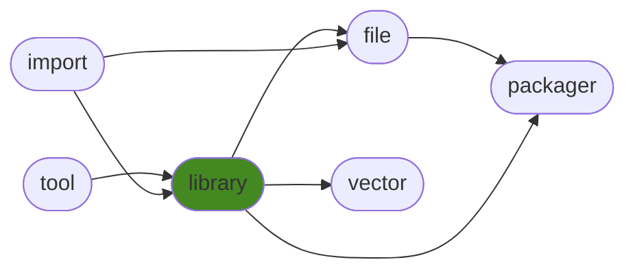

<h1>generallibrary</h1>

Random useful code categorized into modules.

<h2>Table of Contents</h2>

<pre>
<a href='#generallibrary'>generallibrary</a>
├─ <a href='#Dependency-Diagram-for-ManderaGeneral'>Dependency Diagram for ManderaGeneral</a>
├─ <a href='#Installation-showing-dependencies'>Installation showing dependencies</a>
├─ <a href='#Information'>Information</a>
├─ <a href='#Attributes'>Attributes</a>
├─ <a href='#Contributions'>Contributions</a>
└─ <a href='#Todo'>Todo</a>
</pre>

<h2>Dependency Diagram for ManderaGeneral</h2>

<h2>Installation showing dependencies</h2>

| `pip install`                                                      | `generallibrary`   | `generallibrary[table]`   | `generallibrary[full]`   |
|:-------------------------------------------------------------------|:-------------------|:--------------------------|:-------------------------|
| <a href='https://pypi.org/project/generalimport'>generalimport</a> | ✔️                 | ✔️                        | ✔️                       |
| <a href='https://pypi.org/project/generaltool'>generaltool</a>     | ✔️                 | ✔️                        | ✔️                       |
| <a href='https://pypi.org/project/packaging'>packaging</a>         | ✔️                 | ✔️                        | ✔️                       |
| <a href='https://pypi.org/project/pyperclip'>pyperclip</a>         | ✔️                 | ✔️                        | ✔️                       |
| <a href='https://pypi.org/project/pytz'>pytz</a>                   | ✔️                 | ✔️                        | ✔️                       |
| <a href='https://pypi.org/project/dill'>dill</a>                   | ✔️                 | ✔️                        | ✔️                       |
| <a href='https://pypi.org/project/matplotlib'>matplotlib</a>       | ✔️                 | ✔️                        | ✔️                       |
| <a href='https://pypi.org/project/networkx'>networkx</a>           | ✔️                 | ✔️                        | ✔️                       |
| <a href='https://pypi.org/project/pandas'>pandas</a>               | ❌                  | ✔️                        | ✔️                       |
| <a href='https://pypi.org/project/tabulate'>tabulate</a>           | ❌                  | ✔️                        | ✔️                       |

<h2>Information</h2>

| Package                                                            | Ver                                                | Latest Release        | Python                                                                                                                                                                                                                                                 | Platform        | Cover   |
|:-------------------------------------------------------------------|:---------------------------------------------------|:----------------------|:-------------------------------------------------------------------------------------------------------------------------------------------------------------------------------------------------------------------------------------------------------|:----------------|:--------|
| [generallibrary](https://github.com/ManderaGeneral/generallibrary) | [2.9.12](https://pypi.org/project/generallibrary/) | 2022-10-27 16:21 CEST | [3.8](https://www.python.org/downloads/release/python-380/), [3.9](https://www.python.org/downloads/release/python-390/), [3.10](https://www.python.org/downloads/release/python-3100/), [3.11](https://www.python.org/downloads/release/python-3110/) | Windows, Ubuntu | 93.2 %  |

<h2>Attributes</h2>

<pre>
<a href='https://github.com/ManderaGeneral/generallibrary/blob/master/generallibrary/__init__.py#L1'>Module: generallibrary</a>
├─ <a href='https://github.com/ManderaGeneral/generallibrary/blob/master/generallibrary/functions.py#L203'>Class: AutoInitBases</a>
├─ <a href='https://github.com/ManderaGeneral/generallibrary/blob/master/generallibrary/values.py#L10'>Class: BoolStr</a>
├─ <a href='https://github.com/ManderaGeneral/generallibrary/blob/master/generallibrary/functions.py#L92'>Class: CallTable</a>
│  ├─ <a href='https://github.com/ManderaGeneral/generallibrary/blob/master/generallibrary/functions.py#L137'>Method: generate</a>
│  ├─ <a href='https://github.com/ManderaGeneral/generallibrary/blob/master/generallibrary/functions.py#L141'>Method: generate_with_args</a>
│  ├─ <a href='https://github.com/ManderaGeneral/generallibrary/blob/master/generallibrary/functions.py#L145'>Method: generate_with_funcs</a>
│  ├─ <a href='https://github.com/ManderaGeneral/generallibrary/blob/master/generallibrary/functions.py#L105'>Method: set_args</a>
│  └─ <a href='https://github.com/ManderaGeneral/generallibrary/blob/master/generallibrary/functions.py#L100'>Method: set_funcs</a>
├─ <a href='https://github.com/ManderaGeneral/generallibrary/blob/master/generallibrary/code.py#L133'>Class: CodeLine</a>
│  ├─ <a href='https://github.com/ManderaGeneral/generallibrary/blob/master/generallibrary/code.py#L151'>Method: get_lines</a>
│  └─ <a href='https://github.com/ManderaGeneral/generallibrary/blob/master/generallibrary/code.py#L166'>Method: text</a>
├─ <a href='https://github.com/ManderaGeneral/generallibrary/blob/master/generallibrary/values.py#L216'>Class: Crud</a>
│  ├─ <a href='https://github.com/ManderaGeneral/generallibrary/blob/master/generallibrary/values.py#L222'>Method: set</a>
│  ├─ <a href='https://github.com/ManderaGeneral/generallibrary/blob/master/generallibrary/values.py#L226'>Method: set_value</a>
│  ├─ <a href='https://github.com/ManderaGeneral/generallibrary/blob/master/generallibrary/values.py#L224'>Method: unset</a>
│  └─ <a href='https://github.com/ManderaGeneral/generallibrary/blob/master/generallibrary/values.py#L228'>Method: unset_value</a>
├─ <a href='https://github.com/ManderaGeneral/generallibrary/blob/master/generallibrary/objinfo/objinfo.py#L229'>Class: DataClass</a>
│  ├─ <a href='https://github.com/ManderaGeneral/generallibrary/blob/master/generallibrary/objinfo/objinfo.py#L222'>Method: field_dict</a>
│  └─ <a href='https://github.com/ManderaGeneral/generallibrary/blob/master/generallibrary/objinfo/objinfo.py#L216'>Method: field_values</a>
├─ <a href='https://github.com/ManderaGeneral/generallibrary/blob/master/generallibrary/time.py#L54'>Class: Date</a>
│  ├─ <a href='https://github.com/ManderaGeneral/generallibrary/blob/master/generallibrary/time.py#L77'>Method: get_timezone_obj</a>
│  └─ <a href='https://github.com/ManderaGeneral/generallibrary/blob/master/generallibrary/time.py#L81'>Method: now</a>
├─ <a href='https://github.com/ManderaGeneral/generallibrary/blob/master/generallibrary/context.py#L9'>Class: DecoContext</a>
│  ├─ <a href='https://github.com/ManderaGeneral/generallibrary/blob/master/generallibrary/context.py#L23'>Method: after</a>
│  ├─ <a href='https://github.com/ManderaGeneral/generallibrary/blob/master/generallibrary/context.py#L20'>Method: before</a>
│  └─ <a href='https://github.com/ManderaGeneral/generallibrary/blob/master/generallibrary/context.py#L26'>Method: run_func_again</a>
├─ <a href='https://github.com/ManderaGeneral/generallibrary/blob/master/generallibrary/functions.py#L83'>Class: EmptyContext</a>
├─ <a href='https://github.com/ManderaGeneral/generallibrary/blob/master/generallibrary/values.py#L158'>Class: EnvVar</a>
│  ├─ <a href='https://github.com/ManderaGeneral/generallibrary/blob/master/generallibrary/values.py#L189'>Method: remove</a>
│  └─ <a href='https://github.com/ManderaGeneral/generallibrary/blob/master/generallibrary/values.py#L174'>Property: value</a>
├─ <a href='https://github.com/ManderaGeneral/generallibrary/blob/master/generallibrary/functions.py#L211'>Class: HierarchyStorer</a>
├─ <a href='https://github.com/ManderaGeneral/generallibrary/blob/master/generallibrary/code.py#L20'>Class: Log</a>
│  ├─ <a href='https://github.com/ManderaGeneral/generallibrary/blob/master/generallibrary/functions.py#L250'>Method: assert_max_one_missing_name</a>
│  ├─ <a href='https://github.com/ManderaGeneral/generallibrary/blob/master/generallibrary/code.py#L70'>Method: configure_file</a>
│  ├─ <a href='https://github.com/ManderaGeneral/generallibrary/blob/master/generallibrary/code.py#L74'>Method: configure_stream</a>
│  ├─ <a href='https://github.com/ManderaGeneral/generallibrary/blob/master/generallibrary/code.py#L55'>Method: critical</a>
│  ├─ <a href='https://github.com/ManderaGeneral/generallibrary/blob/master/generallibrary/code.py#L51'>Method: debug</a>
│  ├─ <a href='https://github.com/ManderaGeneral/generallibrary/blob/master/generallibrary/code.py#L54'>Method: error</a>
│  ├─ <a href='https://github.com/ManderaGeneral/generallibrary/blob/master/generallibrary/code.py#L52'>Method: info</a>
│  ├─ <a href='https://github.com/ManderaGeneral/generallibrary/blob/master/generallibrary/code.py#L82'>Method: is_root</a>
│  ├─ <a href='https://github.com/ManderaGeneral/generallibrary/blob/master/generallibrary/code.py#L78'>Method: loggers</a>
│  ├─ <a href='https://github.com/ManderaGeneral/generallibrary/blob/master/generallibrary/functions.py#L314'>Method: recycle_clear</a>
│  ├─ <a href='https://github.com/ManderaGeneral/generallibrary/blob/master/generallibrary/functions.py#L319'>Method: recycle_clear_all</a>
│  └─ <a href='https://github.com/ManderaGeneral/generallibrary/blob/master/generallibrary/code.py#L53'>Method: warning</a>
├─ <a href='https://github.com/ManderaGeneral/generallibrary/blob/master/generallibrary/diagram.py#L595'>Class: Markdown</a>
│  ├─ <a href='https://github.com/ManderaGeneral/generallibrary/blob/master/generallibrary/diagram.py#L721'>Method: add_code_lines</a>
│  ├─ <a href='https://github.com/ManderaGeneral/generallibrary/blob/master/generallibrary/diagram.py#L686'>Method: add_lines</a>
│  ├─ <a href='https://github.com/ManderaGeneral/generallibrary/blob/master/generallibrary/diagram.py#L716'>Method: add_list_lines</a>
│  ├─ <a href='https://github.com/ManderaGeneral/generallibrary/blob/master/generallibrary/diagram.py#L727'>Method: add_pre_lines</a>
│  ├─ <a href='https://github.com/ManderaGeneral/generallibrary/blob/master/generallibrary/diagram.py#L706'>Method: add_table_lines</a>
│  ├─ <a href='https://github.com/ManderaGeneral/generallibrary/blob/master/generallibrary/diagram.py#L628'>Method: format_header</a>
│  ├─ <a href='https://github.com/ManderaGeneral/generallibrary/blob/master/generallibrary/diagram.py#L695'>Method: get_all_lines</a>
│  ├─ <a href='https://github.com/ManderaGeneral/generallibrary/blob/master/generallibrary/diagram.py#L670'>Method: get_section_lines</a>
│  ├─ <a href='https://github.com/ManderaGeneral/generallibrary/blob/master/generallibrary/diagram.py#L647'>Method: get_tags_post</a>
│  ├─ <a href='https://github.com/ManderaGeneral/generallibrary/blob/master/generallibrary/diagram.py#L611'>Method: link</a>
│  ├─ <a href='https://github.com/ManderaGeneral/generallibrary/blob/master/generallibrary/diagram.py#L664'>Method: render</a>
│  ├─ <a href='https://github.com/ManderaGeneral/generallibrary/blob/master/generallibrary/diagram.py#L639'>Method: update_collapsible</a>
│  └─ <a href='https://github.com/ManderaGeneral/generallibrary/blob/master/generallibrary/diagram.py#L732'>Method: wrap_with_tags</a>
├─ <a href='https://github.com/ManderaGeneral/generallibrary/blob/master/generallibrary/diagram.py#L556'>Class: NetworkDiagram</a>
│  ├─ <a href='https://github.com/ManderaGeneral/generallibrary/blob/master/generallibrary/diagram.py#L579'>Method: get_spouse</a>
│  └─ <a href='https://github.com/ManderaGeneral/generallibrary/blob/master/generallibrary/diagram.py#L564'>Method: get_spouses</a>
├─ <a href='https://github.com/ManderaGeneral/generallibrary/blob/master/generallibrary/objinfo/objinfo.py#L18'>Class: ObjInfo</a>
│  ├─ <a href='https://github.com/ManderaGeneral/generallibrary/blob/master/generallibrary/objinfo/objinfo.py#L18'>Class: ObjInfo</a>
│  ├─ <a href='https://github.com/ManderaGeneral/generallibrary/blob/master/generallibrary/diagram.py#L205'>Method: add_node</a>
│  ├─ <a href='https://github.com/ManderaGeneral/generallibrary/blob/master/generallibrary/objinfo/parents.py#L59'>Method: check_if_parent_eligible</a>
│  ├─ <a href='https://github.com/ManderaGeneral/generallibrary/blob/master/generallibrary/objinfo/properties.py#L141'>Method: defined_by_parent</a>
│  ├─ <a href='https://github.com/ManderaGeneral/generallibrary/blob/master/generallibrary/diagram.py#L285'>Method: disconnect</a>
│  ├─ <a href='https://github.com/ManderaGeneral/generallibrary/blob/master/generallibrary/objinfo/properties.py#L116'>Method: doc</a>
│  ├─ <a href='https://github.com/ManderaGeneral/generallibrary/blob/master/generallibrary/objinfo/properties.py#L52'>Method: file</a>
│  ├─ <a href='https://github.com/ManderaGeneral/generallibrary/blob/master/generallibrary/objinfo/origin.py#L28'>Method: from_base</a>
│  ├─ <a href='https://github.com/ManderaGeneral/generallibrary/blob/master/generallibrary/objinfo/origin.py#L21'>Method: from_builtin</a>
│  ├─ <a href='https://github.com/ManderaGeneral/generallibrary/blob/master/generallibrary/objinfo/origin.py#L36'>Method: from_class</a>
│  ├─ <a href='https://github.com/ManderaGeneral/generallibrary/blob/master/generallibrary/objinfo/origin.py#L51'>Method: from_instance</a>
│  ├─ <a href='https://github.com/ManderaGeneral/generallibrary/blob/master/generallibrary/objinfo/origin.py#L58'>Method: from_module</a>
│  ├─ <a href='https://github.com/ManderaGeneral/generallibrary/blob/master/generallibrary/diagram.py#L296'>Method: get_all</a>
│  ├─ <a href='https://github.com/ManderaGeneral/generallibrary/blob/master/generallibrary/diagram.py#L225'>Method: get_child</a>
│  ├─ <a href='https://github.com/ManderaGeneral/generallibrary/blob/master/generallibrary/diagram.py#L403'>Method: get_children</a>
│  ├─ <a href='https://github.com/ManderaGeneral/generallibrary/blob/master/generallibrary/diagram.py#L107'>Method: get_connections</a>
│  ├─ <a href='https://github.com/ManderaGeneral/generallibrary/blob/master/generallibrary/objinfo/properties.py#L91'>Method: get_definition_line</a>
│  ├─ <a href='https://github.com/ManderaGeneral/generallibrary/blob/master/generallibrary/diagram.py#L176'>Method: get_index</a>
│  ├─ <a href='https://github.com/ManderaGeneral/generallibrary/blob/master/generallibrary/objinfo/properties.py#L103'>Method: get_lines</a>
│  ├─ <a href='https://github.com/ManderaGeneral/generallibrary/blob/master/generallibrary/diagram.py#L251'>Method: get_node</a>
│  ├─ <a href='https://github.com/ManderaGeneral/generallibrary/blob/master/generallibrary/diagram.py#L441'>Method: get_nodes</a>
│  ├─ <a href='https://github.com/ManderaGeneral/generallibrary/blob/master/generallibrary/diagram.py#L313'>Method: get_ordered</a>
│  ├─ <a href='https://github.com/ManderaGeneral/generallibrary/blob/master/generallibrary/diagram.py#L277'>Method: get_ordered_index</a>
│  ├─ <a href='https://github.com/ManderaGeneral/generallibrary/blob/master/generallibrary/objinfo/properties.py#L85'>Method: get_origin</a>
│  ├─ <a href='https://github.com/ManderaGeneral/generallibrary/blob/master/generallibrary/diagram.py#L238'>Method: get_parent</a>
│  ├─ <a href='https://github.com/ManderaGeneral/generallibrary/blob/master/generallibrary/diagram.py#L422'>Method: get_parents</a>
│  ├─ <a href='https://github.com/ManderaGeneral/generallibrary/blob/master/generallibrary/diagram.py#L264'>Method: get_sibling</a>
│  ├─ <a href='https://github.com/ManderaGeneral/generallibrary/blob/master/generallibrary/diagram.py#L458'>Method: get_siblings</a>
│  ├─ <a href='https://github.com/ManderaGeneral/generallibrary/blob/master/generallibrary/diagram.py#L92'>Method: graph</a>
│  ├─ <a href='https://github.com/ManderaGeneral/generallibrary/blob/master/generallibrary/objinfo/objinfo.py#L61'>Method: identifier</a>
│  ├─ <a href='https://github.com/ManderaGeneral/generallibrary/blob/master/generallibrary/objinfo/properties.py#L17'>Method: internal</a>
│  ├─ <a href='https://github.com/ManderaGeneral/generallibrary/blob/master/generallibrary/objinfo/type.py#L34'>Method: is_class</a>
│  ├─ <a href='https://github.com/ManderaGeneral/generallibrary/blob/master/generallibrary/objinfo/type.py#L28'>Method: is_function</a>
│  ├─ <a href='https://github.com/ManderaGeneral/generallibrary/blob/master/generallibrary/objinfo/type.py#L50'>Method: is_instance</a>
│  ├─ <a href='https://github.com/ManderaGeneral/generallibrary/blob/master/generallibrary/objinfo/type.py#L59'>Method: is_method</a>
│  ├─ <a href='https://github.com/ManderaGeneral/generallibrary/blob/master/generallibrary/objinfo/type.py#L22'>Method: is_module</a>
│  ├─ <a href='https://github.com/ManderaGeneral/generallibrary/blob/master/generallibrary/objinfo/type.py#L44'>Method: is_property</a>
│  ├─ <a href='https://github.com/ManderaGeneral/generallibrary/blob/master/generallibrary/diagram.py#L125'>Method: mermaid</a>
│  ├─ <a href='https://github.com/ManderaGeneral/generallibrary/blob/master/generallibrary/objinfo/properties.py#L43'>Method: module</a>
│  ├─ <a href='https://github.com/ManderaGeneral/generallibrary/blob/master/generallibrary/objinfo/properties.py#L75'>Method: print_link_to_obj</a>
│  ├─ <a href='https://github.com/ManderaGeneral/generallibrary/blob/master/generallibrary/objinfo/properties.py#L26'>Method: private</a>
│  ├─ <a href='https://github.com/ManderaGeneral/generallibrary/blob/master/generallibrary/objinfo/properties.py#L34'>Method: protected</a>
│  ├─ <a href='https://github.com/ManderaGeneral/generallibrary/blob/master/generallibrary/objinfo/properties.py#L9'>Method: public</a>
│  ├─ <a href='https://github.com/ManderaGeneral/generallibrary/blob/master/generallibrary/diagram.py#L214'>Method: remove_node</a>
│  ├─ <a href='https://github.com/ManderaGeneral/generallibrary/blob/master/generallibrary/diagram.py#L189'>Method: set_index</a>
│  ├─ <a href='https://github.com/ManderaGeneral/generallibrary/blob/master/generallibrary/diagram.py#L369'>Method: set_parent</a>
│  ├─ <a href='https://github.com/ManderaGeneral/generallibrary/blob/master/generallibrary/objinfo/parents.py#L7'>Method: spawn_parents</a>
│  ├─ <a href='https://github.com/ManderaGeneral/generallibrary/blob/master/generallibrary/objinfo/type.py#L8'>Method: type</a>
│  └─ <a href='https://github.com/ManderaGeneral/generallibrary/blob/master/generallibrary/diagram.py#L508'>Method: view</a>
├─ <a href='https://github.com/ManderaGeneral/generallibrary/blob/master/generallibrary/decorators.py#L385'>Class: Operators</a>
│  └─ <a href='https://github.com/ManderaGeneral/generallibrary/blob/master/generallibrary/decorators.py#L396'>Method: deco_define_comparisons</a>
├─ <a href='https://github.com/ManderaGeneral/generallibrary/blob/master/generallibrary/functions.py#L217'>Class: Recycle</a>
│  ├─ <a href='https://github.com/ManderaGeneral/generallibrary/blob/master/generallibrary/functions.py#L250'>Method: assert_max_one_missing_name</a>
│  ├─ <a href='https://github.com/ManderaGeneral/generallibrary/blob/master/generallibrary/functions.py#L314'>Method: recycle_clear</a>
│  └─ <a href='https://github.com/ManderaGeneral/generallibrary/blob/master/generallibrary/functions.py#L319'>Method: recycle_clear_all</a>
├─ <a href='https://github.com/ManderaGeneral/generallibrary/blob/master/generallibrary/context.py#L70'>Class: RedirectStdout</a>
├─ <a href='https://github.com/ManderaGeneral/generallibrary/blob/master/generallibrary/decorators.py#L22'>Class: SigInfo</a>
│  ├─ <a href='https://github.com/ManderaGeneral/generallibrary/blob/master/generallibrary/decorators.py#L265'>Method: call</a>
│  ├─ <a href='https://github.com/ManderaGeneral/generallibrary/blob/master/generallibrary/decorators.py#L48'>Property: callableObject</a>
│  ├─ <a href='https://github.com/ManderaGeneral/generallibrary/blob/master/generallibrary/decorators.py#L52'>Method: class_from_callable</a>
│  ├─ <a href='https://github.com/ManderaGeneral/generallibrary/blob/master/generallibrary/decorators.py#L178'>Property: defaults</a>
│  ├─ <a href='https://github.com/ManderaGeneral/generallibrary/blob/master/generallibrary/decorators.py#L220'>Method: getIndexFromName</a>
│  ├─ <a href='https://github.com/ManderaGeneral/generallibrary/blob/master/generallibrary/decorators.py#L146'>Property: leadingArgNames</a>
│  ├─ <a href='https://github.com/ManderaGeneral/generallibrary/blob/master/generallibrary/decorators.py#L126'>Property: names</a>
│  ├─ <a href='https://github.com/ManderaGeneral/generallibrary/blob/master/generallibrary/decorators.py#L136'>Property: namesRequired</a>
│  ├─ <a href='https://github.com/ManderaGeneral/generallibrary/blob/master/generallibrary/decorators.py#L131'>Property: namesWithoutDefaults</a>
│  ├─ <a href='https://github.com/ManderaGeneral/generallibrary/blob/master/generallibrary/decorators.py#L141'>Property: namesWithoutPacked</a>
│  ├─ <a href='https://github.com/ManderaGeneral/generallibrary/blob/master/generallibrary/decorators.py#L227'>Property: packedArgs</a>
│  ├─ <a href='https://github.com/ManderaGeneral/generallibrary/blob/master/generallibrary/decorators.py#L164'>Property: packedArgsName</a>
│  ├─ <a href='https://github.com/ManderaGeneral/generallibrary/blob/master/generallibrary/decorators.py#L232'>Property: packedKwargs</a>
│  ├─ <a href='https://github.com/ManderaGeneral/generallibrary/blob/master/generallibrary/decorators.py#L171'>Property: packedKwargsName</a>
│  ├─ <a href='https://github.com/ManderaGeneral/generallibrary/blob/master/generallibrary/decorators.py#L85'>Property: parameters</a>
│  ├─ <a href='https://github.com/ManderaGeneral/generallibrary/blob/master/generallibrary/decorators.py#L204'>Property: positionalArgNames</a>
│  ├─ <a href='https://github.com/ManderaGeneral/generallibrary/blob/master/generallibrary/decorators.py#L188'>Property: positionalOnlyArgNames</a>
│  ├─ <a href='https://github.com/ManderaGeneral/generallibrary/blob/master/generallibrary/decorators.py#L197'>Property: positionalOnlyOppositeArgNames</a>
│  ├─ <a href='https://github.com/ManderaGeneral/generallibrary/blob/master/generallibrary/decorators.py#L212'>Property: positionalOppositeArgNames</a>
│  ├─ <a href='https://github.com/ManderaGeneral/generallibrary/blob/master/generallibrary/decorators.py#L75'>Property: positional_extra</a>
│  ├─ <a href='https://github.com/ManderaGeneral/generallibrary/blob/master/generallibrary/decorators.py#L237'>Property: unpackedArgs</a>
│  └─ <a href='https://github.com/ManderaGeneral/generallibrary/blob/master/generallibrary/decorators.py#L248'>Property: unpackedKwargs</a>
├─ <a href='https://github.com/ManderaGeneral/generallibrary/blob/master/generallibrary/iterables.py#L5'>Class: SortedList</a>
│  ├─ <a href='https://github.com/ManderaGeneral/generallibrary/blob/master/generallibrary/iterables.py#L32'>Method: add</a>
│  └─ <a href='https://github.com/ManderaGeneral/generallibrary/blob/master/generallibrary/iterables.py#L49'>Method: remove</a>
├─ <a href='https://github.com/ManderaGeneral/generallibrary/blob/master/generallibrary/diagram.py#L345'>Class: Storable</a>
│  ├─ <a href='https://github.com/ManderaGeneral/generallibrary/blob/master/generallibrary/diagram.py#L355'>Method: copy_node</a>
│  ├─ <a href='https://github.com/ManderaGeneral/generallibrary/blob/master/generallibrary/diagram.py#L350'>Method: load_node</a>
│  └─ <a href='https://github.com/ManderaGeneral/generallibrary/blob/master/generallibrary/diagram.py#L347'>Method: save_node</a>
├─ <a href='https://github.com/ManderaGeneral/generallibrary/blob/master/generallibrary/functions.py#L359'>Class: Terminal</a>
│  ├─ <a href='https://github.com/ManderaGeneral/generallibrary/blob/master/generallibrary/functions.py#L382'>Method: call</a>
│  └─ <a href='https://github.com/ManderaGeneral/generallibrary/blob/master/generallibrary/functions.py#L405'>Method: get_args</a>
├─ <a href='https://github.com/ManderaGeneral/generallibrary/blob/master/generallibrary/time.py#L20'>Class: Timer</a>
│  ├─ <a href='https://github.com/ManderaGeneral/generallibrary/blob/master/generallibrary/time.py#L28'>Method: output_time</a>
│  └─ <a href='https://github.com/ManderaGeneral/generallibrary/blob/master/generallibrary/time.py#L33'>Method: time</a>
├─ <a href='https://github.com/ManderaGeneral/generallibrary/blob/master/generallibrary/diagram.py#L485'>Class: TreeDiagram</a>
│  └─ <a href='https://github.com/ManderaGeneral/generallibrary/blob/master/generallibrary/diagram.py#L508'>Method: view</a>
├─ <a href='https://github.com/ManderaGeneral/generallibrary/blob/master/generallibrary/versions.py#L11'>Class: Ver</a>
│  ├─ <a href='https://github.com/ManderaGeneral/generallibrary/blob/master/generallibrary/versions.py#L28'>Method: bump</a>
│  ├─ <a href='https://github.com/ManderaGeneral/generallibrary/blob/master/generallibrary/versions.py#L16'>Method: parse_ver_string</a>
│  └─ <a href='https://github.com/ManderaGeneral/generallibrary/blob/master/generallibrary/versions.py#L25'>Method: three_parts</a>
├─ <a href='https://github.com/ManderaGeneral/generallibrary/blob/master/generallibrary/versions.py#L263'>Class: VerInfo</a>
│  ├─ <a href='https://github.com/ManderaGeneral/generallibrary/blob/master/generallibrary/versions.py#L213'>Property: caseSensitive</a>
│  ├─ <a href='https://github.com/ManderaGeneral/generallibrary/blob/master/generallibrary/versions.py#L248'>Property: env_var_path_delimiter</a>
│  ├─ <a href='https://github.com/ManderaGeneral/generallibrary/blob/master/generallibrary/versions.py#L227'>Property: pathDelimiter</a>
│  ├─ <a href='https://github.com/ManderaGeneral/generallibrary/blob/master/generallibrary/versions.py#L241'>Property: pathRootHasColon</a>
│  ├─ <a href='https://github.com/ManderaGeneral/generallibrary/blob/master/generallibrary/versions.py#L234'>Property: pathRootIsDelimiter</a>
│  ├─ <a href='https://github.com/ManderaGeneral/generallibrary/blob/master/generallibrary/versions.py#L220'>Property: positionalArgument</a>
│  ├─ <a href='https://github.com/ManderaGeneral/generallibrary/blob/master/generallibrary/versions.py#L175'>Property: pythonAlpha</a>
│  ├─ <a href='https://github.com/ManderaGeneral/generallibrary/blob/master/generallibrary/versions.py#L180'>Property: pythonBeta</a>
│  ├─ <a href='https://github.com/ManderaGeneral/generallibrary/blob/master/generallibrary/versions.py#L185'>Property: pythonCandidate</a>
│  ├─ <a href='https://github.com/ManderaGeneral/generallibrary/blob/master/generallibrary/versions.py#L190'>Property: pythonFinal</a>
│  ├─ <a href='https://github.com/ManderaGeneral/generallibrary/blob/master/generallibrary/versions.py#L144'>Property: pythonMajor</a>
│  ├─ <a href='https://github.com/ManderaGeneral/generallibrary/blob/master/generallibrary/versions.py#L154'>Property: pythonMicro</a>
│  ├─ <a href='https://github.com/ManderaGeneral/generallibrary/blob/master/generallibrary/versions.py#L149'>Property: pythonMinor</a>
│  ├─ <a href='https://github.com/ManderaGeneral/generallibrary/blob/master/generallibrary/versions.py#L195'>Property: pythonReleaseKeyword</a>
│  ├─ <a href='https://github.com/ManderaGeneral/generallibrary/blob/master/generallibrary/versions.py#L159'>Property: pythonReleaseLevel</a>
│  ├─ <a href='https://github.com/ManderaGeneral/generallibrary/blob/master/generallibrary/versions.py#L165'>Property: pythonSerial</a>
│  ├─ <a href='https://github.com/ManderaGeneral/generallibrary/blob/master/generallibrary/versions.py#L170'>Property: pythonSerialString</a>
│  ├─ <a href='https://github.com/ManderaGeneral/generallibrary/blob/master/generallibrary/versions.py#L200'>Property: pythonString</a>
│  ├─ <a href='https://github.com/ManderaGeneral/generallibrary/blob/master/generallibrary/versions.py#L205'>Property: pythonVersion</a>
│  └─ <a href='https://github.com/ManderaGeneral/generallibrary/blob/master/generallibrary/versions.py#L255'>Property: venv_script_path</a>
├─ <a href='https://github.com/ManderaGeneral/generallibrary/blob/master/generallibrary/functions.py#L201'>Function: auto_deco</a>
├─ <a href='https://github.com/ManderaGeneral/generallibrary/blob/master/generallibrary/objinfo/objinfo.py#L120'>Function: cache_clear</a>
├─ <a href='https://github.com/ManderaGeneral/generallibrary/blob/master/generallibrary/functions.py#L39'>Function: calculate</a>
├─ <a href='https://github.com/ManderaGeneral/generallibrary/blob/master/generallibrary/objinfo/objinfo.py#L134'>Function: call_base_hooks</a>
├─ <a href='https://github.com/ManderaGeneral/generallibrary/blob/master/generallibrary/values.py#L38'>Function: ceil</a>
├─ <a href='https://github.com/ManderaGeneral/generallibrary/blob/master/generallibrary/values.py#L47'>Function: clamp</a>
├─ <a href='https://github.com/ManderaGeneral/generallibrary/blob/master/generallibrary/functions.py#L16'>Class: classproperty</a>
├─ <a href='https://github.com/ManderaGeneral/generallibrary/blob/master/generallibrary/code.py#L115'>Function: clipboard_copy</a>
├─ <a href='https://github.com/ManderaGeneral/generallibrary/blob/master/generallibrary/code.py#L128'>Function: clipboard_get</a>
├─ <a href='https://github.com/ManderaGeneral/generallibrary/blob/master/generallibrary/iterables.py#L284'>Function: combine</a>
├─ <a href='https://github.com/ManderaGeneral/generallibrary/blob/master/generallibrary/text.py#L16'>Function: comma_and_and</a>
├─ <a href='https://github.com/ManderaGeneral/generallibrary/blob/master/generallibrary/text.py#L20'>Function: comma_and_or</a>
├─ <a href='https://github.com/ManderaGeneral/generallibrary/blob/master/generallibrary/values.py#L129'>Function: confineTo</a>
├─ <a href='https://github.com/ManderaGeneral/generallibrary/blob/master/generallibrary/code.py#L172'>Function: debug</a>
├─ <a href='https://github.com/ManderaGeneral/generallibrary/blob/master/generallibrary/decorators.py#L337'>Function: deco_bound_defaults</a>
├─ <a href='https://github.com/ManderaGeneral/generallibrary/blob/master/generallibrary/decorators.py#L15'>Function: deco_cache</a>
├─ <a href='https://github.com/ManderaGeneral/generallibrary/blob/master/generallibrary/decorators.py#L303'>Function: deco_cast_parameters</a>
├─ <a href='https://github.com/ManderaGeneral/generallibrary/blob/master/generallibrary/decorators.py#L321'>Function: deco_cast_to_self</a>
├─ <a href='https://github.com/ManderaGeneral/generallibrary/blob/master/generallibrary/decorators.py#L357'>Function: deco_extend</a>
├─ <a href='https://github.com/ManderaGeneral/generallibrary/blob/master/generallibrary/decorators.py#L280'>Function: deco_optional_suppress</a>
├─ <a href='https://github.com/ManderaGeneral/generallibrary/blob/master/generallibrary/decorators.py#L368'>Function: deco_propagate_while</a>
├─ <a href='https://github.com/ManderaGeneral/generallibrary/blob/master/generallibrary/decorators.py#L418'>Function: deco_require</a>
├─ <a href='https://github.com/ManderaGeneral/generallibrary/blob/master/generallibrary/functions.py#L62'>Function: defaults</a>
├─ <a href='https://github.com/ManderaGeneral/generallibrary/blob/master/generallibrary/iterables.py#L93'>Function: depth</a>
├─ <a href='https://github.com/ManderaGeneral/generallibrary/blob/master/generallibrary/iterables.py#L327'>Function: dict_insert</a>
├─ <a href='https://github.com/ManderaGeneral/generallibrary/blob/master/generallibrary/objinfo/objinfo.py#L153'>Function: dir_appearance_order</a>
├─ <a href='https://github.com/ManderaGeneral/generallibrary/blob/master/generallibrary/values.py#L104'>Function: doubleRectify</a>
├─ <a href='https://github.com/ManderaGeneral/generallibrary/blob/master/generallibrary/serialize.py#L24'>Function: dumps</a>
├─ <a href='https://github.com/ManderaGeneral/generallibrary/blob/master/generallibrary/iterables.py#L254'>Function: exclusive</a>
├─ <a href='https://github.com/ManderaGeneral/generallibrary/blob/master/generallibrary/iterables.py#L115'>Function: extend_list_in_dict</a>
├─ <a href='https://github.com/ManderaGeneral/generallibrary/blob/master/generallibrary/iterables.py#L312'>Function: flatten</a>
├─ <a href='https://github.com/ManderaGeneral/generallibrary/blob/master/generallibrary/values.py#L34'>Function: floor</a>
├─ <a href='https://github.com/ManderaGeneral/generallibrary/blob/master/generallibrary/iterables.py#L160'>Function: get</a>
├─ <a href='https://github.com/ManderaGeneral/generallibrary/blob/master/generallibrary/types.py#L164'>Function: getBaseClassNames</a>
├─ <a href='https://github.com/ManderaGeneral/generallibrary/blob/master/generallibrary/types.py#L132'>Function: getBaseClasses</a>
├─ <a href='https://github.com/ManderaGeneral/generallibrary/blob/master/generallibrary/objinfo/objinfo.py#L125'>Function: get_attrs_from_bases</a>
├─ <a href='https://github.com/ManderaGeneral/generallibrary/blob/master/generallibrary/code.py#L249'>Function: get_definition_line</a>
├─ <a href='https://github.com/ManderaGeneral/generallibrary/blob/master/generallibrary/iterables.py#L139'>Function: get_free_index</a>
├─ <a href='https://github.com/ManderaGeneral/generallibrary/blob/master/generallibrary/iterables.py#L175'>Function: get_index</a>
├─ <a href='https://github.com/ManderaGeneral/generallibrary/blob/master/generallibrary/iterables.py#L78'>Function: get_items</a>
├─ <a href='https://github.com/ManderaGeneral/generallibrary/blob/master/generallibrary/values.py#L200'>Function: get_launch_options</a>
├─ <a href='https://github.com/ManderaGeneral/generallibrary/blob/master/generallibrary/code.py#L204'>Function: get_origin</a>
├─ <a href='https://github.com/ManderaGeneral/generallibrary/blob/master/generallibrary/iterables.py#L221'>Function: get_rows</a>
├─ <a href='https://github.com/ManderaGeneral/generallibrary/blob/master/generallibrary/iterables.py#L70'>Function: get_values</a>
├─ <a href='https://github.com/ManderaGeneral/generallibrary/blob/master/generallibrary/object.py#L8'>Function: getsize</a>
├─ <a href='https://github.com/ManderaGeneral/generallibrary/blob/master/generallibrary/types.py#L176'>Function: hasMethod</a>
├─ <a href='https://github.com/ManderaGeneral/generallibrary/blob/master/generallibrary/objinfo/objinfo.py#L87'>Function: hook</a>
├─ <a href='https://github.com/ManderaGeneral/generallibrary/blob/master/generallibrary/iterables.py#L259'>Function: inclusive</a>
├─ <a href='https://github.com/ManderaGeneral/generallibrary/blob/master/generallibrary/functions.py#L150'>Function: initBases</a>
├─ <a href='https://github.com/ManderaGeneral/generallibrary/blob/master/generallibrary/values.py#L78'>Function: inrange</a>
├─ <a href='https://github.com/ManderaGeneral/generallibrary/blob/master/generallibrary/object.py#L34'>Function: interconnect</a>
├─ <a href='https://github.com/ManderaGeneral/generallibrary/blob/master/generallibrary/iterables.py#L86'>Function: is_iterable</a>
├─ <a href='https://github.com/ManderaGeneral/generallibrary/blob/master/generallibrary/iterables.py#L100'>Function: iter_first_value</a>
├─ <a href='https://github.com/ManderaGeneral/generallibrary/blob/master/generallibrary/iterables.py#L110'>Function: join_with_str</a>
├─ <a href='https://github.com/ManderaGeneral/generallibrary/blob/master/generallibrary/serialize.py#L30'>Function: loads</a>
├─ <a href='https://github.com/ManderaGeneral/generallibrary/blob/master/generallibrary/text.py#L46'>Function: match</a>
├─ <a href='https://github.com/ManderaGeneral/generallibrary/blob/master/generallibrary/iterables.py#L307'>Function: pivot_list</a>
├─ <a href='https://github.com/ManderaGeneral/generallibrary/blob/master/generallibrary/text.py#L25'>Function: plur_sing</a>
├─ <a href='https://github.com/ManderaGeneral/generallibrary/blob/master/generallibrary/code.py#L225'>Function: print_link</a>
├─ <a href='https://github.com/ManderaGeneral/generallibrary/blob/master/generallibrary/code.py#L240'>Function: print_link_to_obj</a>
├─ <a href='https://github.com/ManderaGeneral/generallibrary/blob/master/generallibrary/values.py#L92'>Function: rectify</a>
├─ <a href='https://github.com/ManderaGeneral/generallibrary/blob/master/generallibrary/iterables.py#L187'>Function: remove</a>
├─ <a href='https://github.com/ManderaGeneral/generallibrary/blob/master/generallibrary/iterables.py#L275'>Function: remove_duplicates</a>
├─ <a href='https://github.com/ManderaGeneral/generallibrary/blob/master/generallibrary/text.py#L36'>Function: replace</a>
├─ <a href='https://github.com/ManderaGeneral/generallibrary/blob/master/generallibrary/values.py#L42'>Function: round_</a>
├─ <a href='https://github.com/ManderaGeneral/generallibrary/blob/master/generallibrary/values.py#L61'>Function: sign</a>
├─ <a href='https://github.com/ManderaGeneral/generallibrary/blob/master/generallibrary/time.py#L47'>Function: sleep</a>
├─ <a href='https://github.com/ManderaGeneral/generallibrary/blob/master/generallibrary/iterables.py#L297'>Function: split_list</a>
├─ <a href='https://github.com/ManderaGeneral/generallibrary/blob/master/generallibrary/types.py#L5'>Function: strToDynamicType</a>
├─ <a href='https://github.com/ManderaGeneral/generallibrary/blob/master/generallibrary/iterables.py#L319'>Function: subtract_list</a>
├─ <a href='https://github.com/ManderaGeneral/generallibrary/blob/master/generallibrary/types.py#L104'>Function: typeChecker</a>
├─ <a href='https://github.com/ManderaGeneral/generallibrary/blob/master/generallibrary/iterables.py#L264'>Function: unique_obj_in_list</a>
├─ <a href='https://github.com/ManderaGeneral/generallibrary/blob/master/generallibrary/iterables.py#L127'>Function: update_dict_in_dict</a>
└─ <a href='https://github.com/ManderaGeneral/generallibrary/blob/master/generallibrary/decorators.py#L6'>Function: wrapper_transfer</a>
</pre>

<h2>Contributions</h2>

Issue-creation and discussions are most welcome!

Pull requests are currently not wanted, please discuss with me before investing any time

<h2>Todo</h2>

| Module                                                                                                                      | Message                                                                                                                                                                        |
|:----------------------------------------------------------------------------------------------------------------------------|:-------------------------------------------------------------------------------------------------------------------------------------------------------------------------------|
| <a href='https://github.com/ManderaGeneral/generallibrary/blob/master/generallibrary/code.py#L1'>code.py</a>                | <a href='https://github.com/ManderaGeneral/generallibrary/blob/master/generallibrary/code.py#L44'>Make Log use __name__ from previous frame so it doesn't write to root.</a>   |
| <a href='https://github.com/ManderaGeneral/generallibrary/blob/master/generallibrary/code.py#L1'>code.py</a>                | <a href='https://github.com/ManderaGeneral/generallibrary/blob/master/generallibrary/code.py#L71'>Use another delimiter than , in Log and make sure it can handle quotes.</a>  |
| <a href='https://github.com/ManderaGeneral/generallibrary/blob/master/generallibrary/diagram.py#L1'>diagram.py</a>          | <a href='https://github.com/ManderaGeneral/generallibrary/blob/master/generallibrary/diagram.py#L499'>Shared dict for NetworkDiagram, resolve logic with multiple parents.</a> |
| <a href='https://github.com/ManderaGeneral/generallibrary/blob/master/generallibrary/versions.py#L1'>versions.py</a>        | <a href='https://github.com/ManderaGeneral/generallibrary/blob/master/generallibrary/versions.py#L53'>Use Ver in each part of VerInfo.</a>                                     |
| <a href='https://github.com/ManderaGeneral/generallibrary/blob/master/generallibrary/objinfo/objinfo.py#L1'>objinfo.py</a>  | <a href='https://github.com/ManderaGeneral/generallibrary/blob/master/generallibrary/objinfo/objinfo.py#L23'>Recycle ObjInfo.</a>                                              |
| <a href='https://github.com/ManderaGeneral/generallibrary/blob/master/generallibrary/test/test_time.py#L1'>test_time.py</a> | <a href='https://github.com/ManderaGeneral/generallibrary/blob/master/generallibrary/test/test_time.py#L61'>Fix time casting to wrong day when past midnight.</a>              |

Generated 2023-03-07 07:00 CET for commit <a href='https://github.com/ManderaGeneral/generallibrary/commit/master'>master</a>.

